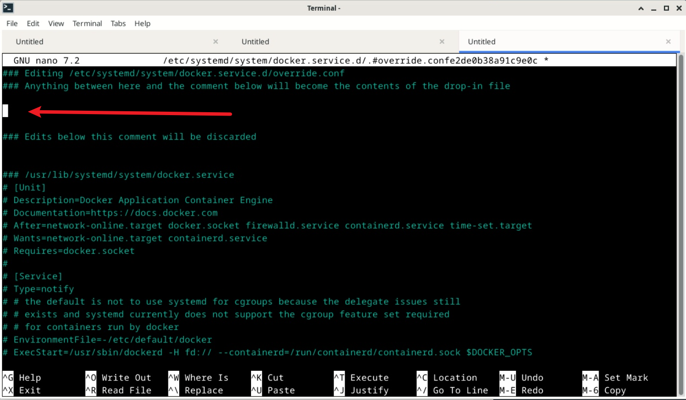

# 安装 riscv64 docker
源中已有 riscv64 的docker安装包，名为 `docker.io`，可以直接使用:

```bash
sudo apt install docker.io
``` 

# 测试 docker

```bash
sudo docker pull riscv64/debian:unstable
```

# 技巧
## Rootless Docker
如果需要不以 root 权限运行 docker, 即如果不用 sudo, 出现了下面的错误：

```bash
debian@lpi4a:~$ docker pull riscv64/debian:unstable
Got permission denied while trying to connect to the Docker daemon socket at unix:///var/run/docker.sock: Post "http://%2Fvar%2Frun%2Fdocker.sock/v1.24/images/create?fromImage=riscv64%2Fdebian&tag=unstable": dial unix /var/run/docker.sock: connect: permission denied
```
需要执行以下命令将用户加入 `docker` 用户组中:

```bash
sudo usermod -aG docker $USER # 或换成需要免root运行docker的用户名
```
重新登陆，如果出现下面的结果即可免特权运行docker
```
$ id
uid=1000(debian) gid=1000(debian) groups=1000(debian),4(adm),7(lp),24(cdrom),25(floppy),27(sudo),29(audio),30(dip),44(video),46(plugdev),105(netdev),106(bluetooth),112(docker),996(input) # 这里出现了 docker 用户组即可
```
## 为 Docker 配置代理
通过 `systemctl edit` 命令，添加一个对 `docker.service` 的修改配置，这种方式相较于直接修改 `docker.service` 更加灵活，避免了系统更新后配置文件被覆盖的问题。

在终端中运行 `sudo systemctl edit docker` 命令，将会打开如下图所示的编辑界面。



在中间空白处插入下面的配置（记得将配置中的代理地址改为实际使用的地址）：
```toml
[Service]
Environment="HTTP_PROXY=http://proxy.example.com:8080/"
Environment="HTTPS_PROXY=http://proxy.example.com:8080/"
Environment="NO_PROXY=localhost,127.0.0.1,.example.com"
```


添加完成后重启 docker 即可
```bash
sudo systemctl restart docker
```