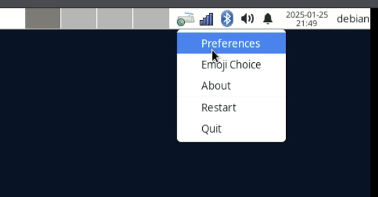
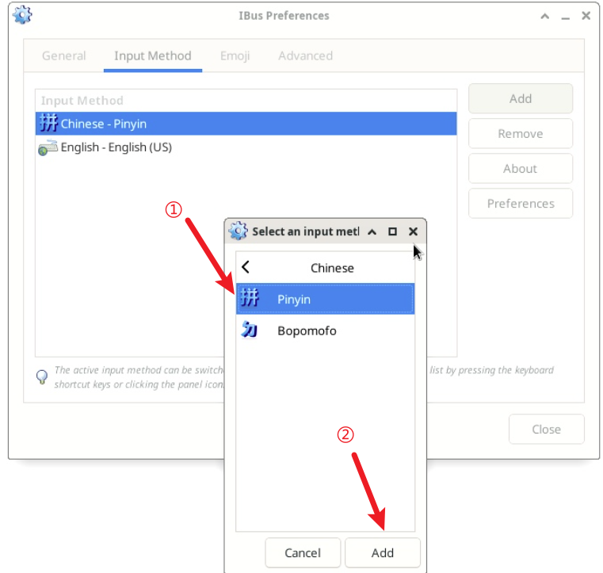

# iBus Input Method

**Status:**  
Operational.

**Resources:**  
[iBus on Debian Wiki](https://wiki.debian.org/I18n/ibus)

### Installation Steps (without using im-config)

```bash
sudo apt install ibus ibus-libpinyin
sudo reboot
```

After rebooting, manually add the Chinese input method:

1. Right-click the iBus tray icon and select **Preferences**.
   

2. In the **Input Method** tab, click **Add** to open the input selection window.
   

3. Select **Chinese -> Pinyin** and click **Add**.
   
